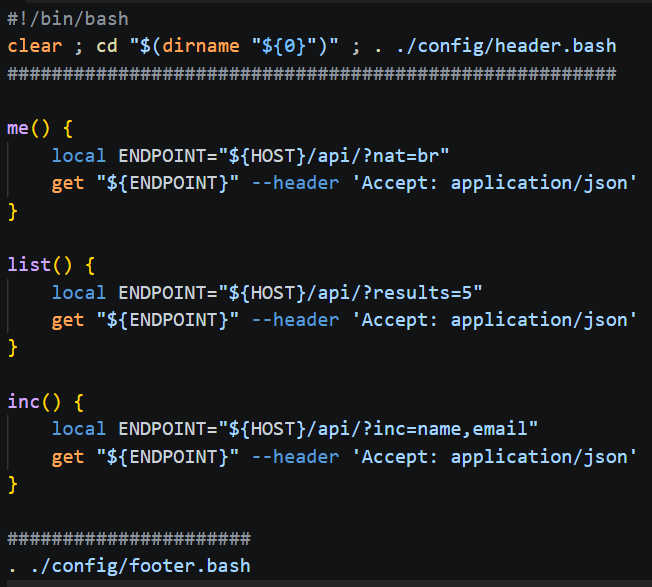
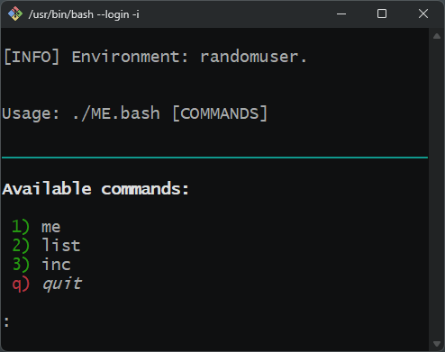

# randomuser.me

Exemplo de requisições CURL utilizando o site [Random User Generator](https://randomuser.me):

 

Exemplo de menu BASH SCRIPT:

 

Links úteis:

- https://gist.github.com/eneko/dc2d8edd9a4b25c5b0725dd123f98b10
